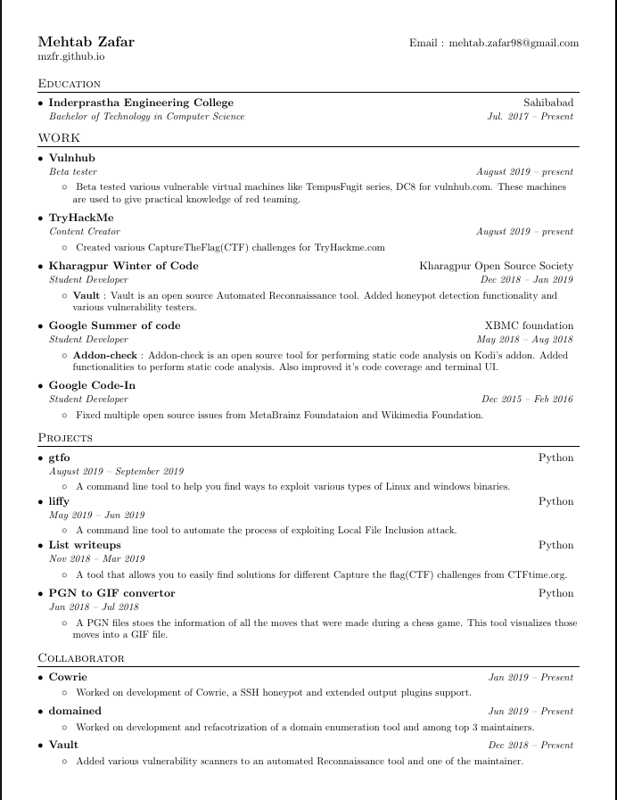

# Resume

This is my resume :smile:



## Template

This is a plain and simple template. If you want to make any changes to the style then consider changing [`Custom commands`](./resume.tex#L40).

To compile the `.tex` file use [laton](./laton) in the following way:

```bash
$ ./laton resume.tex
```

The `laton` file is taken from https://github.com/aslushnikov/latex-online
